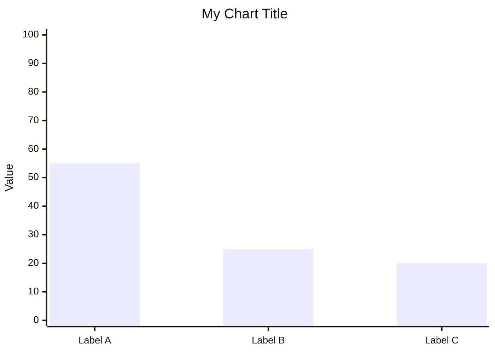

# Community Content Manager

## Purpose
Intelligently manage the `community-content/` directory and publish high-quality technical content to the CareerVivid platform using the `cv` CLI.

## When to Use
- Propose a new post after completing a significant feature or fixing a complex bug.
- Organize existing or new Markdown files into the correct sub-folders.
- Publish drafted content to the live community feed.

## Directory Structure
- `community-content/articles/`: General technical writeups and deep dives.
- `community-content/case-studies/`: Problem-solving narratives and performance optimizations.
- `community-content/interviews/`: Interview preparation materials and candidate stories.
- `community-content/guides/`: Step-by-step tutorials and technical explainers.

## Helper Scripts
### `organize_content.mjs`
Automates categorization based on filename and content analysis.
```bash
node .agent/skills/community-content-manager/scripts/organize_content.mjs organize path/to/file.md
```

## Publishing Workflow
1. **Draft**: Create the `.md` file in the appropriate `community-content/` subfolder.
2. **Review**: Ensure no sensitive information (API keys, etc.) is included.
3. **Initial Publish**: Use `cv publish` for new content.
   ```bash
   cv publish community-content/category/file.md --tags "tag1,tag2"
   ```
4. **Revising Content**: Use `cv update` for all subsequent edits to existing posts. This prevents accidental duplicates.
   ```bash
   cv update community-content/category/file.md
   ```

## Best Practices
- **Mermaid Diagrams**: Always include a Mermaid diagram for architecture or process flows.
- **Explicitness**: Prefer `cv update` over `cv publish` when revising content to ensure that if a `postId` is missing, the command fails rather than creating a duplicate.
- **Upgrade CLI**: Use `cv upgrade` regularly to get the latest agent features and security fixes.
- **Dry Run**: Use `--dry-run` to validate before going live.
- **JSON Output**: Use `--json` when automating from an agent flow.

## Known Mermaid Gotchas (v11+)

The community renderer uses **Mermaid v11**. Two common issues to watch for:

### 1. `pie` charts crash with a parser error
`pie` charts throw `TypeError: Cannot read properties of undefined (reading 'decision')` in Mermaid v11 due to a known grammar lookahead bug. **Replace with `xychart-beta`:**



### 2. Em dashes (`—`) in labels cause syntax errors
Mermaid's lexer rejects em dashes inside node labels and pie/chart labels. Replace `—` with a plain hyphen `-` or a space.

```diff
- "BlogListPage — unbounded onSnapshot" : 55
+ "BlogListPage unbounded onSnapshot" : 55
```

