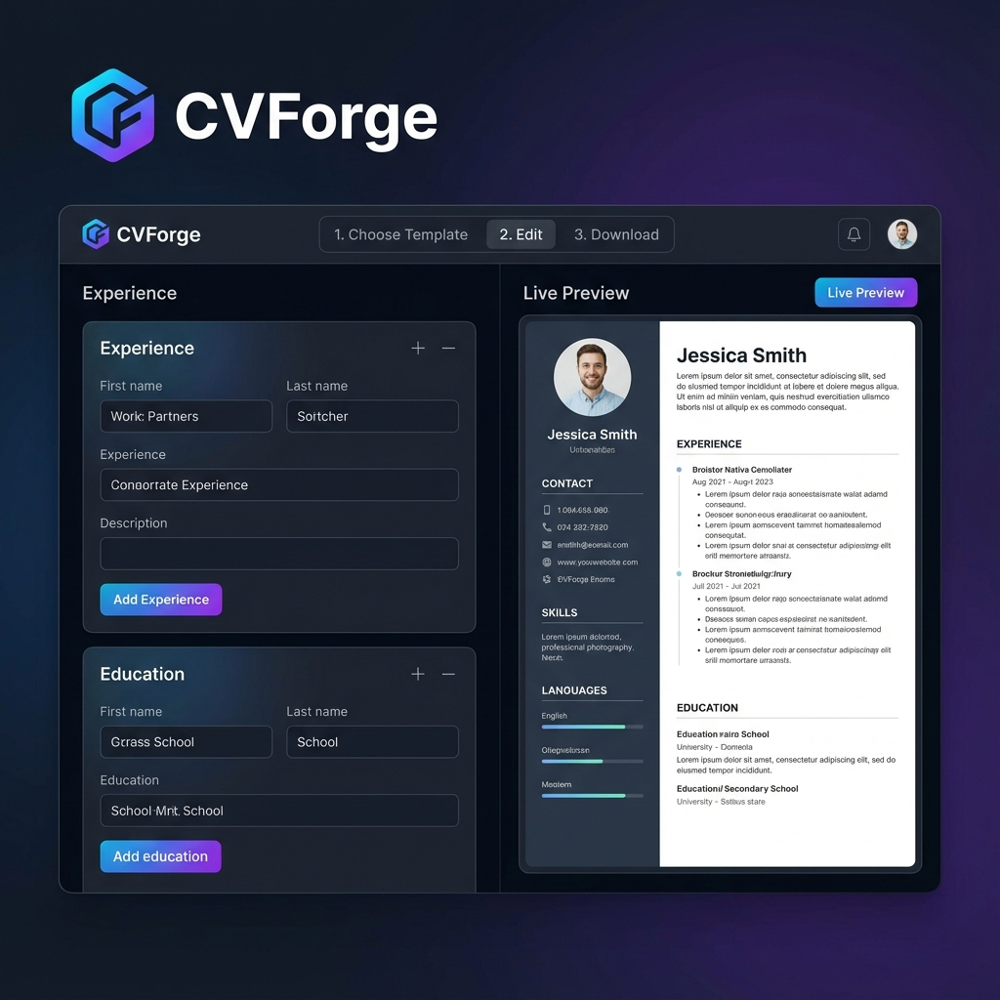

<div align="center">
  
  
  # CareerVivid
  
  **Your AI-Powered Career Assistant**
  
  [](https://opensource.org/licenses/MIT)
  []()
</div>

## About

**CareerVivid** is the ultimate AI-powered career development platform designed to bridge the gap between talent and opportunity. We believe that everyone deserves a fulfilling career, and we provide the cutting-edge tools to help you get there.

Our platform empowers job seekers to land their dream roles faster with advanced AI technology, combining a state-of-the-art **Resume Builder**, a **Real-Time AI Interview Coach**, and a **Portfolio Creator** into one seamless experience.

## Features

### 🚀 AI Resume Builder
Create professional, ATS-optimized resumes that pass the screening bots in minutes.
- **Smart Templates**: Choose from a variety of professional designs.
- **AI Content Generation**: Get intelligent suggestions for summary and bullet points.
- **Real-time Preview**: See changes instantly as you type.

### 🎙️ AI Interview Coach
Practice with a real-time AI voice assistant that simulates actual interviews.
- **Mock Interviews**: Tailored questions based on your target role.
- **Instant Compassionate Feedback**: Get actionable insights on your answers, tone, and pacing.
- **Confidence Building**: Reduce anxiety by practicing in a safe environment.

### 🌐 Personal Portfolio
Instantly generate a beautiful personal website from your resume to showcase your projects.
- **One-Click Generation**: No coding required.
- **Customizable**: Updates automatically with your resume.
- **Shareable URL**: Stand out to recruiters with a professional link.

### 📊 Job Tracker
Organize your entire job search in one dashboard.
- **Status Tracking**: Keep tabs on Applied, Interviewing, and Offer stages.
- **Statistics**: Visualize your progress and conversion rates.

### 🤝 Business Partner Integration
A dedicated portal for HR professionals and Recruiters.
- **Job Management**: Create, publish, and manage job postings.
- **Applicant Tracking System (ATS)**: Review candidates, analyze resume matches with AI, and track status.
- **Status Sync**: HR updates (e.g., Shortlisted, Interviewing) automatically sync to the candidate's personal Job Tracker.

### 🏢 Job Marketplace
A centralized hub for connecting talent with opportunity.
- **AI-Powered Job Search**: Search for jobs using Gemini Grounding with real-time web results.
- **Smart Search & Caching**: Intelligent job indexing allows searching across all cached jobs by company, title, or location.
- **Direct Apply**: Apply to jobs directly with your CareerVivid profile and resumes.
- **Tracker Integration**: One-click addition of jobs to your personal tracker.
- **Mock Interview**: Launch AI-powered mock interviews tailored to specific job postings.

## Recent Updates

### December 2024
- **JobMarketPage Refactoring**: Modular architecture with extracted components, hooks, and utilities (1040 → ~400 lines)
- **Smart Job Search**: Indexed job search across cached results with multi-field querying
- **Job Caching System**: 2-week TTL cache with automatic cleanup for faster job searches
- **Firestore Optimization**: Composite indexes for efficient job queries
- **LLM Standardization**: Unified model usage to **Gemini 3 Flash** across frontend and backend for better performance and consistency
- **Refresh Search**: Added automated refresh capability to force fresh job results and bypass cache
- **Job Link Validation**: Implemented server-side URL validation with automated fallbacks to prevent 404/broken application links

## Getting Started

Follow these steps to set up the project locally on your machine.

### Prerequisites
- [Node.js](https://nodejs.org/) (v16 or higher)
- [npm](https://www.npmjs.com/)

### Installation

1. **Clone the repository**
   ```bash
   git clone https://github.com/Jastalk/CareerVivid.git
   cd careervivid
   ```

2. **Install dependencies**
   ```bash
   npm install
   ```

3. **Configure Environment**
   Create a `.env.local` file in the root directory and add your Gemini API Key:
   ```env
   GEMINI_API_KEY=your_api_key_here
   ```

4. **Run the App**
   Start the development server:
   ```bash
   npm run dev
   ```

## License

This project is licensed under the MIT License - see the [LICENSE](LICENSE) file for details.
