<div align="center">

# CareerVivid

### One practical workspace for the job search, interview practice, and skill building.

[Open the product](https://careervivid.app) · [Browse courses](https://careervivid.app/learning) · [Open Interview Studio](https://careervivid.app/interview-studio) · [View job recommendations](https://careervivid.app/jobs/recommend) · [Read the competition guide](COMPETITION.md)

</div>

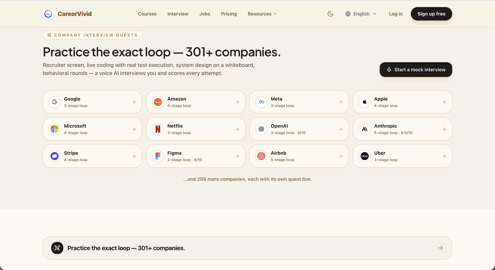

## Built around the candidate loop

CareerVivid keeps the work that usually lives across a resume editor, job board,
interview prep site, and course platform in one connected workflow:

1. Choose the resume and application profile that represent the role you want.
2. Review explainable job matches that account for your evidence, preferences,
   and location.
3. Prepare with company-style recruiter, coding, system-design, and behavioral
   practice.
4. Use feedback to choose the next course lesson, practice task, or application
   action.
5. Return at any time and continue from the exact unfinished lesson or stage.

The product uses a warm editorial presentation for public learning and
competition documentation, and a compact neutral workspace for repeated
candidate work. The README follows that same approach: real screens, concise
explanations, and reproducible evidence.

## See the product

### Find the next role

The dashboard turns a selected resume, target role, readiness, interview
activity, and next action into a job-search operating plan.

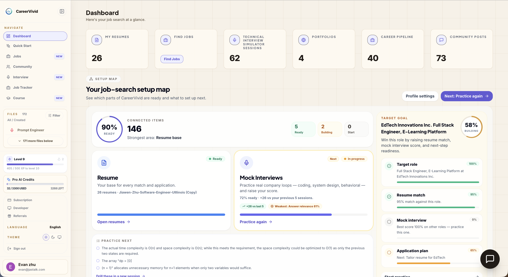

Job recommendations stay tied to the selected target resume. Each role makes
the evidence, gaps, work arrangement, salary information, and direct action
visible instead of presenting an unexplained match number.

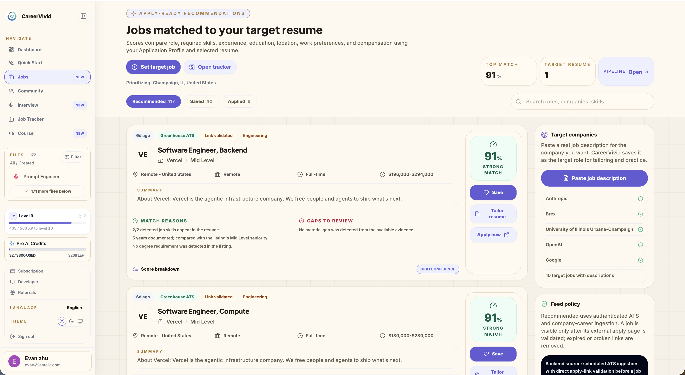

### Practice the interview loop

Interview Studio brings together saved sessions, company guides, preparation
formats, difficulty, and career paths.

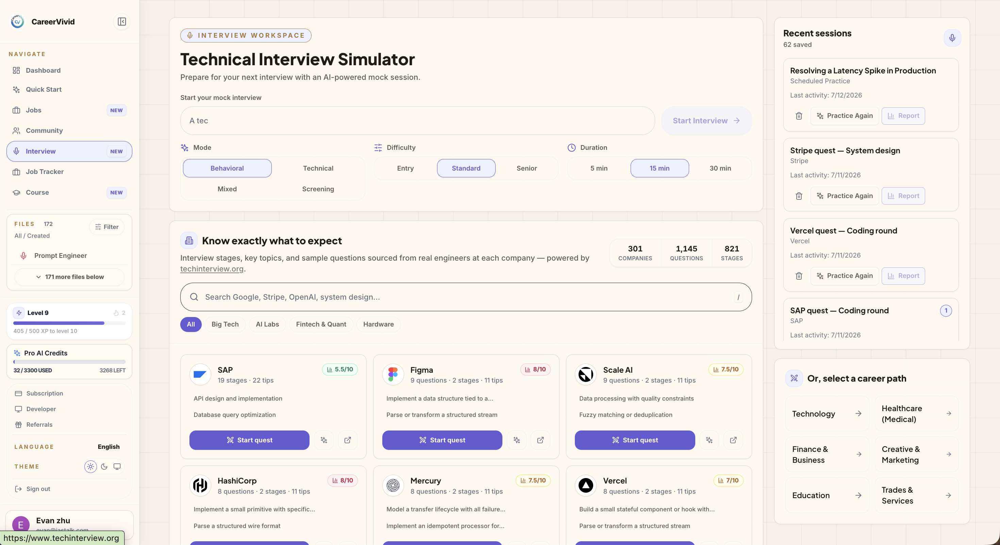

A Company Quest gives the learner a visible stage map for recruiter, coding,
system-design, behavioral, and final-round preparation.

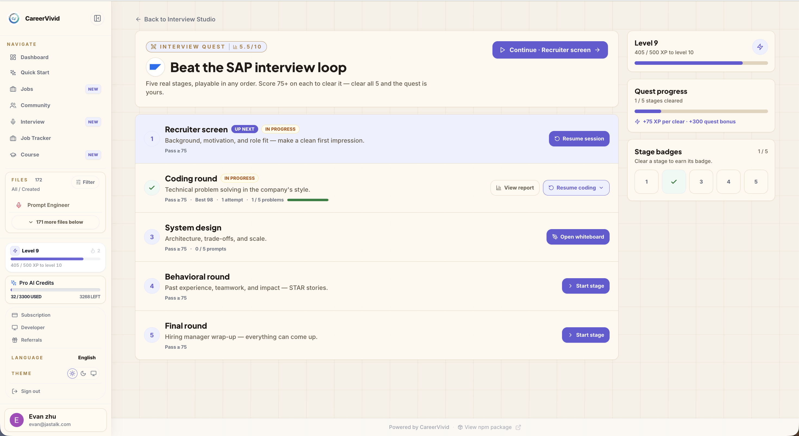

The practice surfaces retain the prompt, requirements, work area, and feedback
context in the same place so the next action is clear.

<details>
<summary><strong>Open the interview-practice gallery</strong></summary>

<br />

**Live recruiter practice** keeps the question queue, task requirements,
transcript, session path, and live signals on one screen.

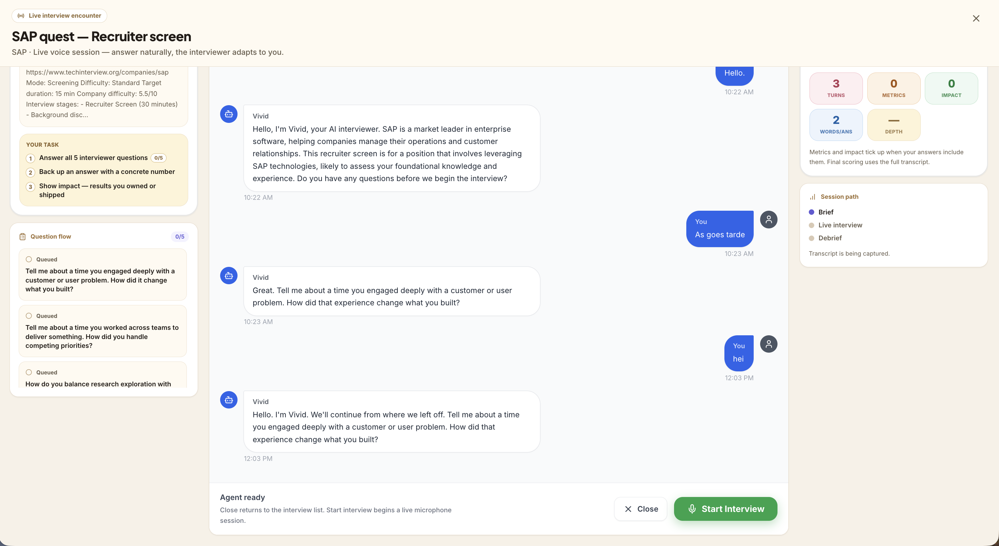

**Targeted coding practice** lets a candidate reopen the specific problem that
needs work, then use a language-aware editor, tests, and AI review.

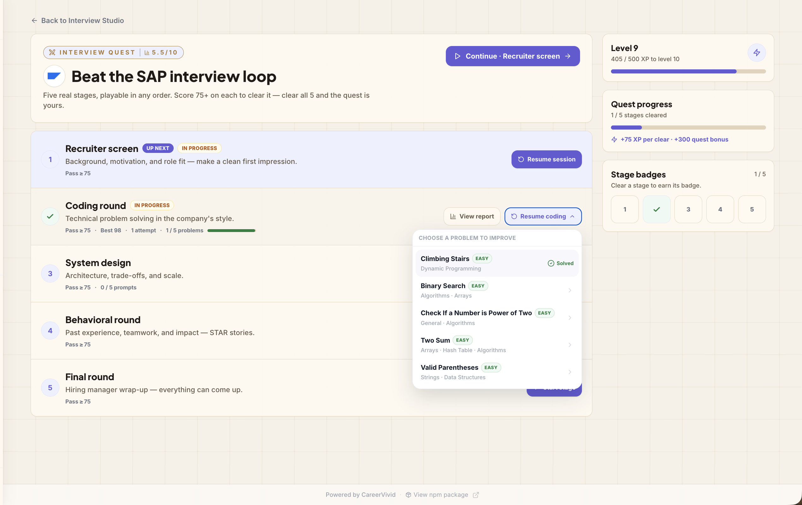

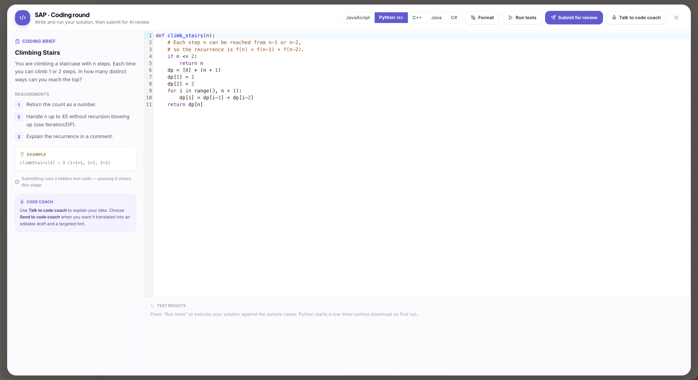

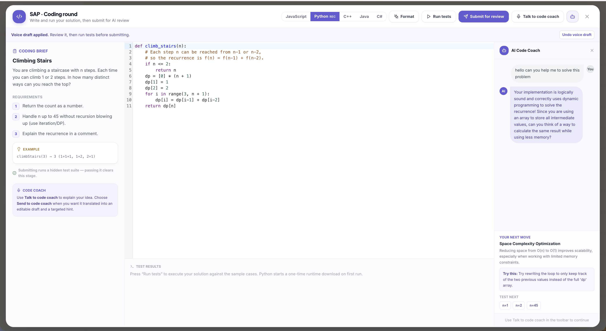

**System-design practice** pairs an editable whiteboard with clear requirements,
AI diagram review, and coaching. Course exercises use a course-owned return
path, so closing a whiteboard returns the learner to the same course lesson.

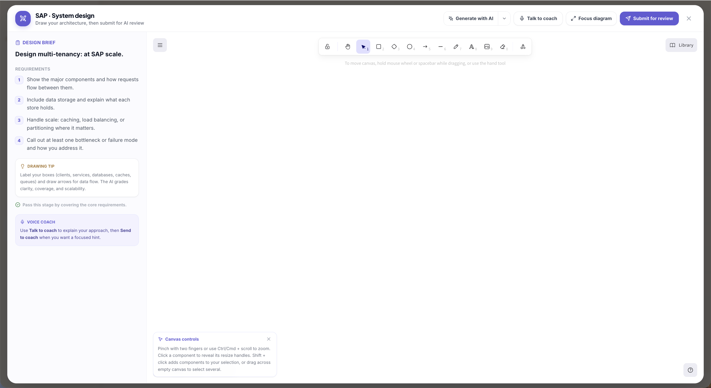

**Interview reports** turn each attempt into focused strengths and the next
improvements to practice.

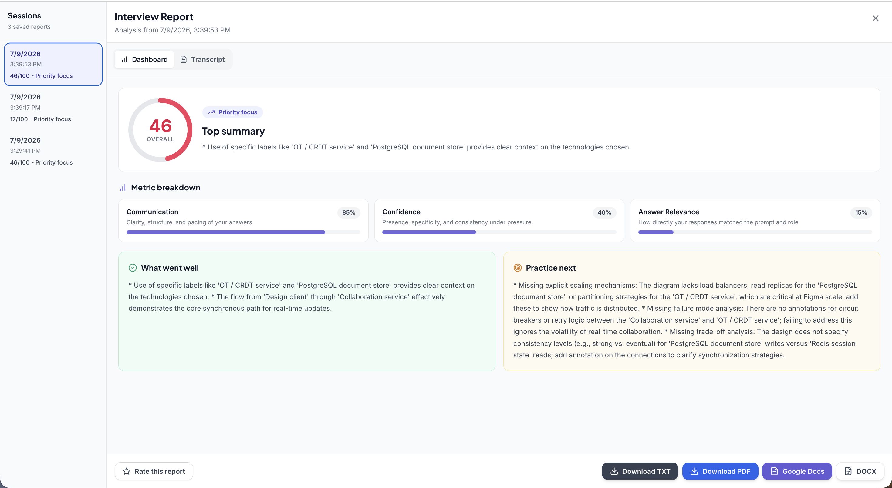

</details>

### Learn by doing

The course catalog connects interview preparation to a structured learning
plan. Progress is saved per lesson; a bare course link resolves to the next
incomplete exercise rather than resetting the learner to the first lesson.

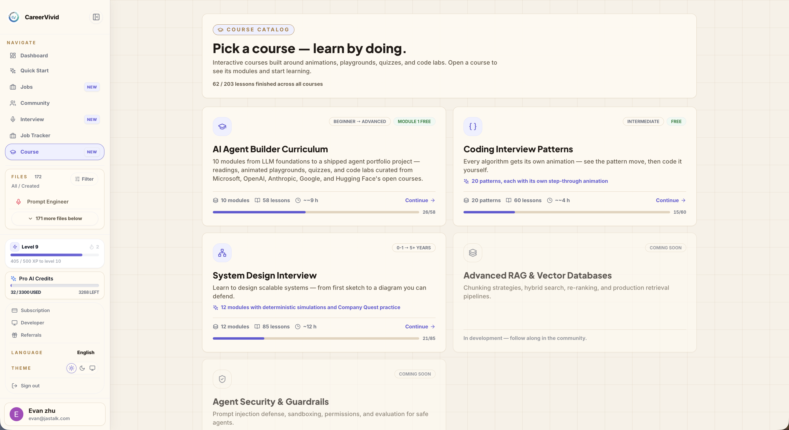

Published courses include:

- **AI Agent Builder Curriculum**: foundations through capstone work using
  readings, interactive playgrounds, videos, quizzes, and code labs.
- **Coding Interview Patterns**: step-through algorithm visualizations and
  runnable practice exercises.
- **System Design Interview**: twelve modules of deterministic simulations,
  scenario decisions, whiteboard exercises, answer drills, and timed mock
  practice.

<details>
<summary><strong>Open the interactive-learning gallery</strong></summary>

<br />

Interactive lessons model a real, observable state rather than using motion as
decoration. Learners change inputs, see the resulting behavior, and complete
the stated lesson criterion.

**Tokens and cost intuition**

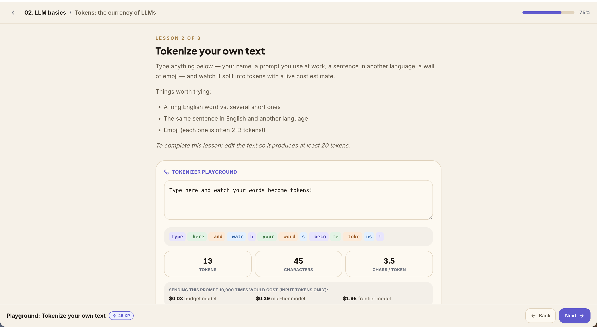

**Context-window behavior**

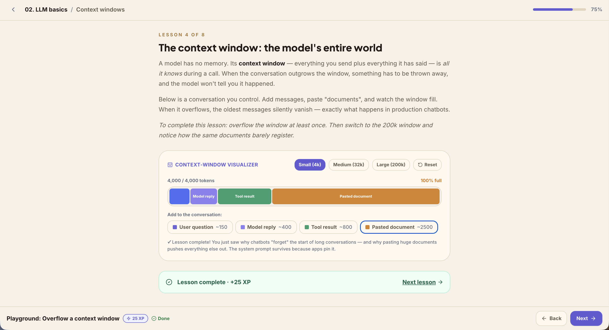

**Curated source material in context**

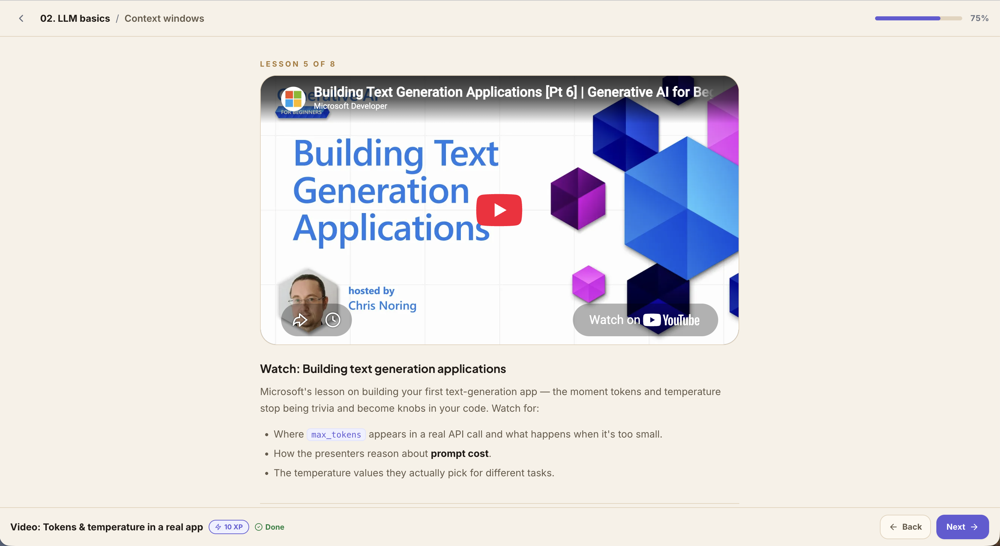

**Retrieval-Augmented Generation**

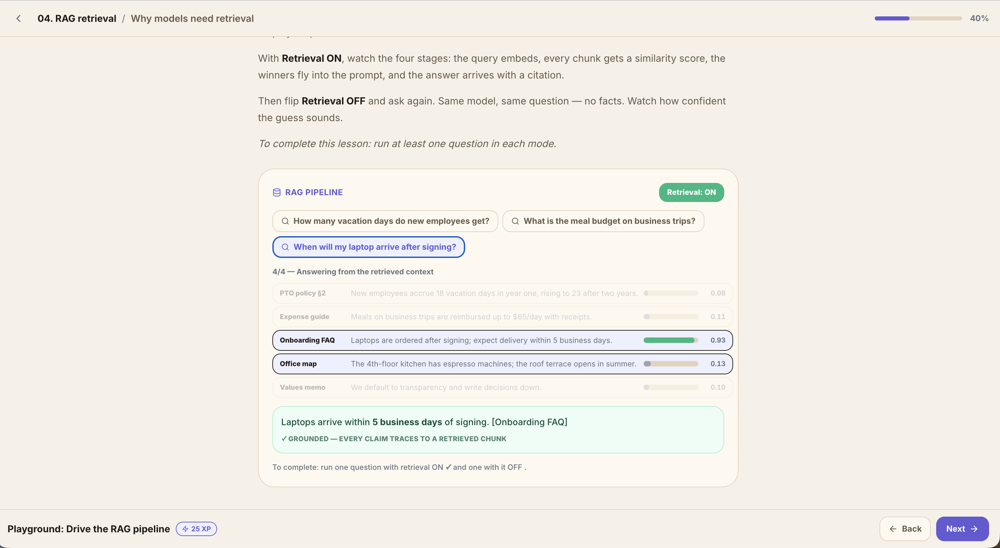

</details>

## How it is put together

| Area | Implementation |
| --- | --- |
| Application | React, TypeScript, Vite, Tailwind CSS, and Framer Motion |
| Identity and persistence | Firebase Auth and Firestore |
| Job data | Official ATS and career-board ingestion with apply-link validation |
| Job matching | Resume, role requirements, experience evidence, location, work preferences, and available compensation information |
| Interview practice | Voice sessions, coding runner, Excalidraw whiteboard, and AI feedback |
| Course delivery | JSON course definitions rendered through a React widget registry |
| AI services | Gemini through controlled application services |
| Hosting | Firebase Hosting |

```text
data/courses/*.json -> course engine -> lesson pages -> saved lesson progress
                                      |
src/components/CourseWidgets/ -> deterministic simulations
                                      |
src/lib/companyQuests.ts -> company-specific prompts and stages
                                      |
functions/ -> job ingestion, AI services, and SEO generation
```

## Run locally

```bash
git clone https://github.com/JiawenZhu/CareerVivid.git
cd CareerVivid
npm ci
npm run dev
```

For local product integrations, provide the required Firebase and AI service
environment values. The Vite development server then exposes the application
locally.

### Verify the application

```bash
npm test -- --run src/lib/interactiveCourses.test.ts src/lib/codingInterviewRoadmap.test.ts src/lib/learningSeo.test.ts src/lib/systemDesignQuestionBank.test.ts
npm run build:vite
```

The focused suite verifies course contracts, widget registration,
deterministic system-design simulation steps, question-bank contracts, and the
experience-roadmap mapping. The Vite build confirms the production bundle can
be generated.

## Repository guide

| Path | Purpose |
| --- | --- |
| [`COMPETITION.md`](COMPETITION.md) | Competition provenance, evaluator path, and submission verification |
| [`CONTRIBUTING.md`](CONTRIBUTING.md) | Contribution workflow and course-content licensing rules |
| `data/courses/` | Data-driven course definitions |
| `data/interview-guides/` | Company interview-guide content |
| `docs/screenshots/` | The product evidence used in this README |
| `src/components/CourseWidgets/` | Interactive course simulations |
| `src/components/Quest/` | Company Quest coding and system-design practice |
| `src/pages/` | Application routes and product surfaces |
| `functions/` | ATS ingestion, AI services, and SEO generation |

## Competition submission

| Item | Evidence |
| --- | --- |
| Submission branch | [`competition-2026`](https://github.com/JiawenZhu/CareerVivid/tree/competition-2026) |
| Eligibility marker | [`competition-start`](https://github.com/JiawenZhu/CareerVivid/tree/competition-start) |
| First qualifying commit | [`42320189`](https://github.com/JiawenZhu/CareerVivid/commit/423201899f3717876c8f3645eaaffed57c5028b8) |
| Competition window | May 19, 2026 at 10:00 AM PDT to August 17, 2026 at 1:00 PM PDT |
| Evaluator guide | [`COMPETITION.md`](COMPETITION.md) |

The annotated `competition-start` tag marks the first qualifying commit after
the competition opened. The repository preserves its actual history; timestamps
and earlier commits have not been rewritten.

## License and contributions

CareerVivid is source-available for personal learning and job-search use.
Commercial use requires the attribution described in the
[CareerVivid Source-Available License](LICENSE). Course source materials retain
their original licenses; see `data/learning/sources.json`.

Contributions are welcome. Start with [CONTRIBUTING.md](CONTRIBUTING.md) for
the development workflow, focused-test expectations, and content licensing
requirements.
