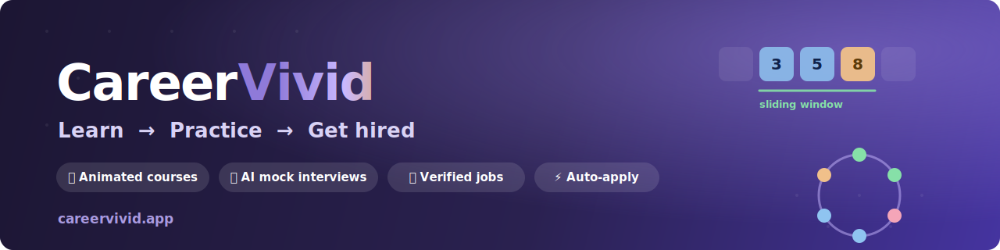

<div align="center">



<br/><br/>

# ✨ CareerVivid

### The open-source **AI career workspace** — job search, interview prep & AI learning in one beautiful app

*Accelerate your career: learn AI hands-on, master coding & system design interviews,*
*optimize your resume, discover verified tech jobs, and auto-apply — all in one continuous workflow.*

<br/>

[](https://careervivid.app)
[](LICENSE)
[](CONTRIBUTING.md)

[](https://react.dev)
[](https://www.typescriptlang.org)
[](https://vitejs.dev)
[](https://tailwindcss.com)
[](https://www.framer.com/motion/)
[](https://firebase.google.com)

<br/>

**[🎓 Courses](https://careervivid.app/learning)** · **[🎤 Interview Studio](https://careervivid.app/interview-studio)** · **[💼 Jobs](https://careervivid.app/jobs/recommend)** · **[📊 Open Metrics](https://careervivid.app/open)**

<br/>

⭐ **If CareerVivid helps your job search, star the repo — it helps other job seekers find it.** ⭐

</div>

<br/>

---

## 🧭 Why CareerVivid

> Job searching is fragmented: one tab for jobs, one for LeetCode, one for system design notes, one for your resume, one spreadsheet for tracking.
>
> **CareerVivid unifies the entire loop — `Learn → Practice → Get hired` — so every hour you invest compounds toward an offer.**

Built for new grads, career switchers, and engineers targeting **tech jobs and AI jobs**. Everything renders in a warm, animation-rich UI that makes interview preparation feel like a game, not a grind.

<br/>

## ✨ Features

<table>
<tr>
<td width="50%" valign="top">

### 🎓 Courses where *every concept is animated*

**🤖 AI Agent Builder Curriculum** — 10 modules from LLM foundations to a shipped agent portfolio project: animated playgrounds *(token prediction · RAG pipelines · agent loops · prompt-injection defense)*, quizzes & in-browser code labs

**🧩 Coding Interview Patterns** — sliding window, two pointers, binary search, backtracking, BFS, DP… each with its **own step-through animation** + test-graded code labs

**🏗️ System Design Interview** — 13 chapters · 85 exercises: the 45-minute interview clock, consistent-hash rings, circuit breakers, feed fan-out, latency flashcards, capacity quick-fire & spot-the-flaw games

</td>
<td width="50%" valign="top">

### 🎤 Company-specific interview practice

**300+ tech companies** with real-format interview guides

Live **AI mock interviews** with voice, task briefs, live objectives & countdown timer

Coding battles · system design whiteboard with **AI diagram review** · Socratic coaching

### ⚔️ Classic Questions Arena

Bit.ly · Twitter timeline · WhatsApp · web crawler · rate limiter · Dropbox sync — every question as a 4-phase drill: **Clarify → Estimate → Design → Follow-up**

</td>
</tr>
<tr>
<td width="50%" valign="top">

### 💼 Verified live jobs + auto-apply

Real-time feed from **official ATS APIs** *(Greenhouse · Lever · Ashby)* across **160+ live company boards** — no scraped spam, no dead links

**AI job matching** ranked against your resume, skills & location

**Auto-apply tooling** + full application tracker: status pipeline, saved JDs, validated apply links

</td>
<td width="50%" valign="top">

### 📄 Resume & career tools

**AI resume optimization** tailored per job description

Application profiles · cover letter drafting · progress analytics with **XP & levels**

Per-lesson persisted progress — return to any course and **resume exactly where you left off**

</td>
</tr>
</table>

<br/>

## 🚀 Quick start

```bash
git clone https://github.com/JiawenZhu/CareerVivid.git
cd CareerVivid
npm install
cp .env.example .env   # add your Firebase + AI provider keys
npm run dev
```

> [!TIP]
> Course content is **data-driven**: each course is one JSON file in `data/courses/`, and every animation is a lazy-loaded widget in the registry. Adding a course or animation needs **zero framework changes** — see [CONTRIBUTING.md](CONTRIBUTING.md).

Requires **Node 18+**. Firebase (Auth / Firestore / Cloud Functions) powers the backend — see `.env.example` for the key list.

<br/>

## 🧱 Architecture at a glance

```
data/courses/*.json ──▶ course engine ──▶ lesson pages
                            │
src/components/CourseWidgets/ ──▶ widget registry (40+ animations, lazy-loaded)
src/lib/systemDesignQuestionBank.ts ──▶ case drills · flashcards · flaw scenes
functions/ ──▶ ATS job ingestion (cron) · AI interview agents · SEO
```

`React 18` · `TypeScript` · `Vite` · `Tailwind CSS` · `Framer Motion` · `Firebase` · `Vitest`

<br/>

## 🗺️ Roadmap

| Status | Milestone |
|:------:|-----------|
| 🔜 | More algorithm animations — heap/top-K · tries · topological sort |
| 🔜 | More Arena cases — YouTube · Uber · notification systems |
| 💡 | Community interview guides & course translations |
| 💡 | Public API for the verified jobs feed |

**Contributions welcome** — see [CONTRIBUTING.md](CONTRIBUTING.md) or grab a [`good first issue`](https://github.com/JiawenZhu/CareerVivid/issues?q=is%3Aissue+is%3Aopen+label%3A%22good+first+issue%22).

<br/>

## 📄 License & commercial use

> [!IMPORTANT]
> CareerVivid is **source-available**: free for personal use, learning, and your own job search.
> **Commercial use requires visible attribution** — a working link to [careervivid.app](https://careervivid.app) in your product **and** README. Full terms in [LICENSE](LICENSE).

The `third_party/` directory and course source materials keep their original licenses (see `data/learning/sources.json`). System design content built on [The System Design Primer](https://github.com/donnemartin/system-design-primer) (CC BY 4.0) is attributed in-app.

<br/>

## 🏆 Competition submission

| | |
|---|---|
| **Submission branch** | [`competition-2026`](https://github.com/JiawenZhu/CareerVivid/tree/competition-2026) |
| **Eligibility marker** | [`competition-start`](https://github.com/JiawenZhu/CareerVivid/tree/competition-start) |
| **Window** | May 19, 2026 10:00 AM PDT → August 17, 2026 1:00 PM PDT |
| **Details** | [COMPETITION.md](COMPETITION.md) |

The `competition-start` annotated tag points to [`42320189`](https://github.com/JiawenZhu/CareerVivid/commit/423201899f3717876c8f3645eaaffed57c5028b8), the first qualifying commit after the competition opened. The branch preserves the repository's actual history; no timestamps or prior commits have been rewritten.

<br/>

## ⭐ Star history

<div align="center">

[](https://star-history.com/#JiawenZhu/CareerVivid&Date)

</div>

---

<div align="center">

<sub>

**job search** · **interview preparation** · **coding interview patterns** · **system design interview** · **AI learning courses** · **resume optimization** · **auto apply jobs** · **mock interviews** · **career development** · **tech jobs** · **AI jobs**

</sub>

<br/>

Built with ❤️ by [**Jiawen Zhu**](https://github.com/JiawenZhu) · [**careervivid.app**](https://careervivid.app)

<br/>

    

</div>
