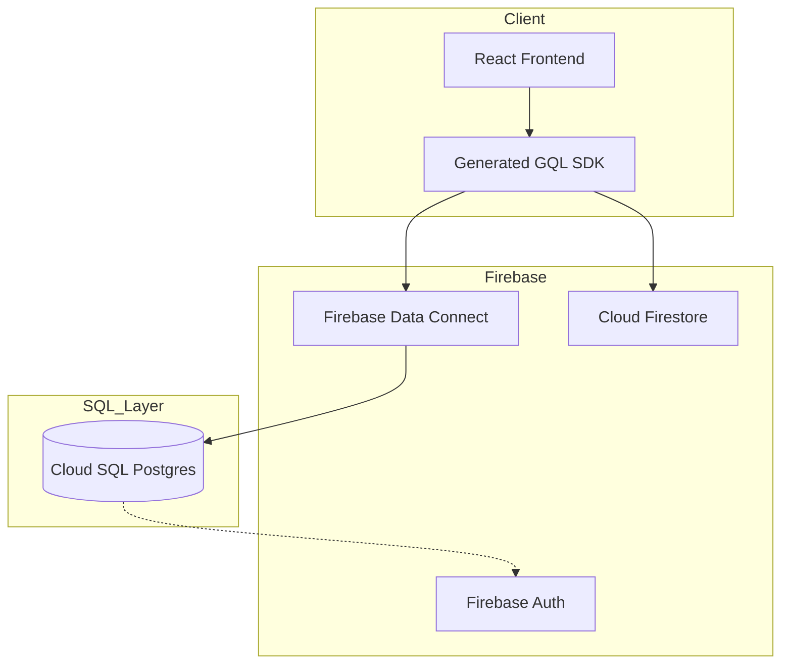

# Simulating 'Moltbook' at Scale: A Hybrid Experiment with Firebase Data Connect (Cloud SQL)

As CareerVivid grows towards millions of posts and hundreds of thousands of active users, we reached a critical architectural crossroad. Our initial pure NoSQL approach, while excellent for productivity tools like resume drafting, faced significant challenges in supporting a high-scale, relational social engine.

Today, we are unveiling our answer: a **Hybrid Architecture** that seamlessly blends the real-time flexibility of **Cloud Firestore** with the relational power of **PostgreSQL via Firebase Data Connect** (Cloud SQL).

## 🏗️ The High-Level Design

Our system now follows a clear functional split:
- **Cloud Firestore**: Continues to power user profiles, workspace configurations, and offline-first resume drafts.
- **Firebase Data Connect (Postgres)**: Powers the social graph (Follows, Likes, Shares) and the global/personalized feeds.



## 💎 The Relational Data Schema

By moving social data into PostgreSQL, we've gained the ability to perform complex relational joins in a single, high-performance query. Below is the exact schema currently powering our community:

### Core Social Tables
- **Users**: Mirrored data from Firebase Auth with real-time social stats (follower counts, post counts).
- **Posts**: Relational content storage with built-in UUID generation and Markdown support.
- **Follows**: A highly optimized join table implementing the social graph with foreign key integrity.
- **Interactions**: Atomic tracking for Likes and Comments.

```sql
-- The "Social Graph" Join Table
CREATE TABLE public.follow (
    follower_id text NOT NULL,
    following_id text NOT NULL,
    created_at timestamp with time zone NOT NULL,
    CONSTRAINT follow_pkey PRIMARY KEY (follower_id, following_id),
    CONSTRAINT follow_follower_id_fkey FOREIGN KEY (follower_id) 
        REFERENCES public.user(id) ON DELETE CASCADE,
    CONSTRAINT follow_following_id_fkey FOREIGN KEY (follower_id) 
        REFERENCES public.user(id) ON DELETE CASCADE
);
```

## 🚀 Performance & Scale Strategies

### 1. Solving the "Celebrity" Fan-out Problem
Traditional NoSQL social networks often "push" new posts into the feeds of all followers. For users with 100k+ followers, this is incredibly expensive. Our new architecture uses a **Pull Model** (Join-based). By utilizing PostgreSQL's efficient B-tree indexing on the `Follow` table, we can aggregate a personalized feed in sub-20ms without redundant data duplication.

### 2. Partial Indexing for Active Content
To keep our database lean, we utilize **Partial Indexes**. Instead of indexing every post since the beginning of time, we maintain tiny, high-speed indexes only for "Active" content (posts from the last 30 days).

### 3. Soft Deletes & Data Hygiene
We've implemented a unified **Soft Delete** pattern (`deletedAt`). This ensures data integrity by preventing index-rebuilding churn while allowing for "Tiered Storage"—older, inactive content can be periodically offloaded to cold storage without breaking existing relational links.

## 🔮 What's Next?
This architecture is just the beginning. By having our social data in PostgreSQL, we are now ready to implement **pgvector-powered Semantic Search**, allowing you to find community content based on concepts and ideas, rather than just keywords.

Stay tuned for our upcoming deep dive on **Vector Embeddings and AI Discovery**!

---
*By the CareerVivid Engineering Team*
*Tags: #Architecture, #PostgreSQL, #Firebase, #Scaling, #Simulation*
