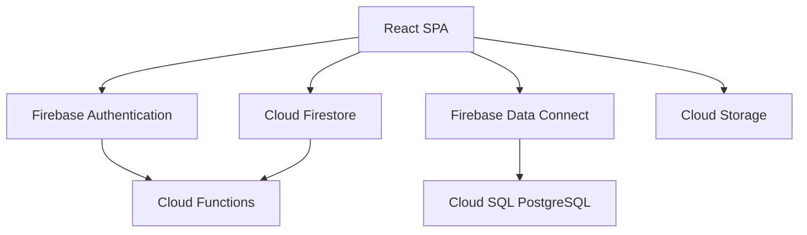
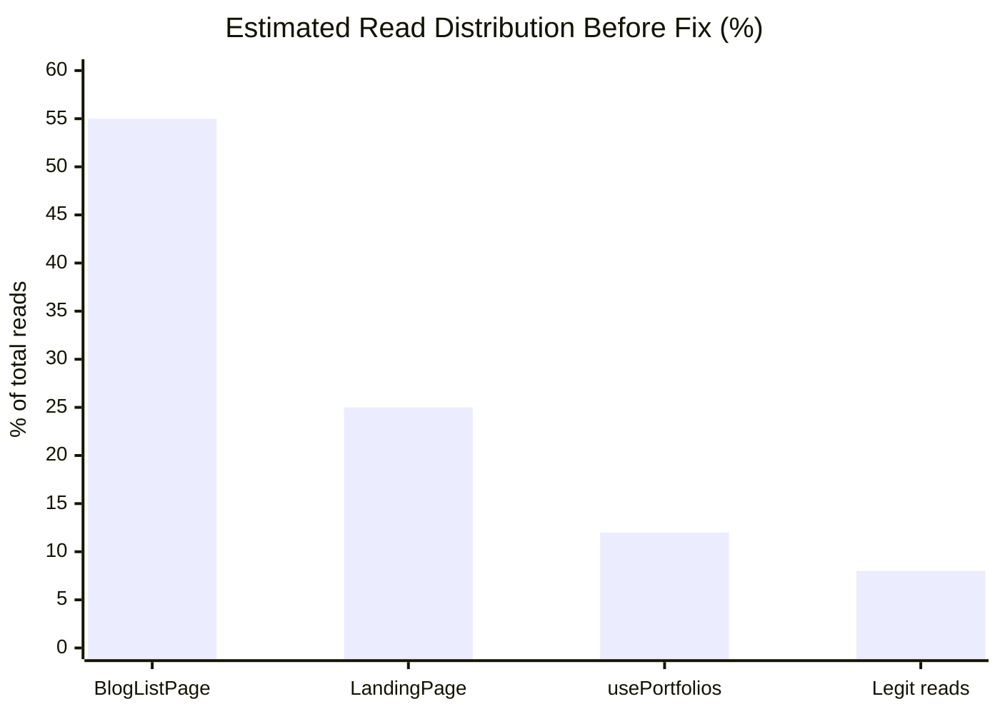

# How We Reduced Firestore Reads by 80%: CareerVivid's Database Architecture Deep Dive

*Published: March 2026 · Engineering · Database Architecture · Performance*

---

At CareerVivid, we run a hybrid database architecture that blends **Cloud Firestore** for real-time user data with **Firebase Data Connect (Cloud SQL / PostgreSQL)** for relational social graph data. This worked beautifully — until our Firestore usage dashboard showed **29,000 reads in a single day** with only a handful of active users.

This post breaks down our full database architecture, how we diagnosed the read spike, and the three targeted fixes that brought costs back under control.

---

## Our Dual-Database Architecture

CareerVivid uses two complementary persistence layers. Each was chosen deliberately to solve a different class of problem.



### Layer 1 — Cloud Firestore (Primary Operational Store)

Firestore is our workhorse. It handles all user-owned, permission-gated, mutable data. Every document in Firestore reflects one user's real-time state, or a community artifact that can be updated by its owner.

**Key collections:**

| Collection | Purpose | Access Pattern |
|---|---|---|
| `users/{uid}` | Auth profile, roles, settings | Owner-read/write, public-read |
| `users/{uid}/resumes/{id}` | Resume documents with share configs | Owner or `shareConfig.enabled` |
| `users/{uid}/portfolios/{id}` | Portfolio builder data | Owner-scoped |
| `users/{uid}/whiteboards/{id}` | Excalidraw canvas state | Owner-scoped |
| `community_posts/{id}` | Community feed posts (Markdown) | Public-read, owner-write |
| `community_post_likes/{id}` | Post engagement metrics | Public-read, authenticated-create |
| `community_post_comments/{id}` | Comments on community posts | Public-read, authenticated-create |
| `blog_posts/{id}` | Platform blog articles | Public-read, admin-write |
| `jobPostings/{id}` | B2B job listings | Published = public, owner + admin |
| `jobApplications/{id}` | Candidate applications | Applicant + owning HR partner |
| `companyProfiles/{id}` | B2B company profiles | Public-read |
| `public_portfolios/{id}` | Publicly shared portfolio snapshots | Public-read, owner-write |
| `public_resumes/{id}` | Publicly shared resume snapshots | Public-read, owner-write |
| `system_settings/{id}` | Global platform config (admin) | Public-read, admin-write |
| `analytics/{id}` | Page view and event counters | Public-update, admin-read |
| `referralCodes/{code}` | Referral and promo codes | Authenticated-read |

**Why Firestore for this layer?**

Firestore shines when you need fine-grained, per-document security rules, offline support, and real-time sync for documents that belong to individual users. Our security rules enforce a layered access model with three role tiers:

```javascript
function isAdmin() {
  return request.auth != null && (
    request.auth.token.email == 'evan@careervivid.app' ||
    get(/databases/$(database)/documents/users/$(request.auth.uid))
      .data.role in ['admin', 'academic_partner', 'super_admin']
  );
}
```

Roles are checked directly inside Firestore rules — no middleware required — so the security boundary lives at the database layer, not in application code that could be bypassed.

---

### Layer 2 — Firebase Data Connect (Social Graph & Relational Queries)

Firestore's document model is excellent for hierarchical user data, but it has a fundamental limitation: **it cannot efficiently query across users**. Answering "give me all posts by users I follow, sorted by time" requires either Firestore compound indexes with denormalized data or multiple waterfall reads.

For CareerVivid's social graph and public feed, we use **Firebase Data Connect**, which is built on **Cloud SQL (PostgreSQL 15)**. Data Connect exposes a GraphQL API over a managed Postgres instance while integrating with Firebase Auth for identity.

**Schema (abbreviated):**

```graphql
type User @table(key: "id") {
  id: String!
  username: String! @unique
  displayName: String
  followerCount: Int! @default(value: 0)
  followingCount: Int! @default(value: 0)
  postCount: Int! @default(value: 0)
  deletedAt: Timestamp  # Soft delete
}

type Post @table(key: "id") {
  id: UUID! @default(expr: "uuidV4()")
  authorId: String!
  author: User! @ref(fields: ["authorId"])
  title: String!
  content: String!  # Markdown
  likesCount: Int! @default(value: 0)
  commentsCount: Int! @default(value: 0)
  viewsCount: Int! @default(value: 0)
  deletedAt: Timestamp  # Soft delete
}

type Follow @table(key: ["followerId", "followingId"]) {
  followerId: String!
  followingId: String!
  createdAt: Timestamp! @default(expr: "request.time")
}
```

This enables true relational queries: follower feeds with `JOIN`, paginated comment threads, and aggregate counts backed by Postgres indexes — all without Firestore's per-read billing.

---

## The Read Spike: 29,000 Reads in 24 Hours

Our Firebase console flagged an unexpected read spike with only a small number of active users. After profiling every `onSnapshot` and `getDocs` call in the codebase, we identified three distinct anti-patterns.



---

### Bug #1 — `BlogListPage`: Unbounded Real-Time Listener

**Root cause:** The blog listing page opened a `WebSocket` to the entire `blog_posts` collection with no `limit()` clause, and re-sorted documents client-side on every snapshot event.

```typescript
// ❌ Before: Live listener on ALL blog posts, client-side sort
const unsubscribe = onSnapshot(query(collection(db, 'blog_posts')), (snap) => {
    const posts = snap.docs.map(d => ({ id: d.id, ...d.data() }));
    posts.sort((a, b) => getTime(b.publishedAt) - getTime(a.publishedAt));
    setPosts(posts);
});
```

Every time any admin published or edited a blog post, all active sessions re-read every doc. And since blog posts are static content — they don't change during a user's session — the real-time listener provided zero UX benefit.

```typescript
// ✅ After: One-time fetch, server-side orderBy + limit
getDocs(query(
    collection(db, 'blog_posts'),
    orderBy('publishedAt', 'desc'),
    limit(50)
)).then((snap) => {
    setPosts(snap.docs.map(d => ({ id: d.id, ...d.data() } as BlogPost)));
});
```

**Impact:** Eliminated the persistent WebSocket connection. Each page visit now costs exactly N reads (where N = posts returned), not N reads × (number of concurrent sessions × update frequency).

---

### Bug #2 — `usePortfolios.deleteAllPortfolios`: `onSnapshot` Used as `getDocs`

**Root cause:** A subtle bug where `onSnapshot` was called inside a mutation function to get a one-time snapshot of documents to delete. But `onSnapshot` is not a one-time operation — it returns a `Unsubscribe` function, not a `QuerySnapshot`. The batch delete was racing against the subscription, and the listener was never cleaned up.

```typescript
// ❌ Before: Starts a permanent listener every time deleteAllPortfolios is called
const snapshot = await onSnapshot(portfoliosCol, (snap) => {
    snap.docs.forEach(doc => batch.delete(doc.ref));
});
await batch.commit(); // Runs BEFORE the snapshot callback fires!
```

This is a particularly nasty bug because `await onSnapshot(...)` resolves immediately to the unsubscribe function — the async-looking syntax masks the fact that the callback is asynchronous. The batch was frequently empty, and each call left a dangling listener.

```typescript
// ✅ After: getDocs for a proper one-time fetch
const snapshot = await getDocs(portfoliosCol);
const batch = writeBatch(db);
snapshot.docs.forEach(doc => batch.delete(doc.ref));
await batch.commit();
```

**Impact:** Eliminated leaked listeners and fixed the batch delete race condition. The delete operation is now deterministic.

---

### Bug #3 — `LandingPage`: Real-Time Listener on Rarely-Changing Config

**Root cause:** The public landing page called `subscribeToLandingPageSettings`, opening a live `onSnapshot` listener to the `system_settings/landing_page` document on every anonymous visitor.

```typescript
// ❌ Before: WebSocket to a config doc that changes once per deploy
const unsubscribe = subscribeToLandingPageSettings((settings) => {
    setResumeSuffix(settings.featuredResumeSuffix);
});
return () => unsubscribe();
```

System settings are updated by an admin at most once per product cycle. Opening a live connection for every site visitor to watch for real-time changes that never happen is pure waste.

```typescript
// ✅ After: Simple one-time getDoc
getLandingPageSettings().then((settings) => {
    if (settings?.featuredResumeSuffix) {
        setResumeSuffix(settings.featuredResumeSuffix);
    }
});
```

The `LandingPageManagement.tsx` admin panel deliberately retains the `onSnapshot` listener so admins immediately see changes they save. The asymmetry is intentional.

**Impact:** Reduced `system_settings` reads from O(sessions × time) to O(1) per session.

---

## The Guiding Principle: `onSnapshot` vs. `getDocs`

The core lesson from this investigation is choosing the right read primitive:

| Situation | Use | Why |
|---|---|---|
| Data changes while the user is on the page | `onSnapshot` | Real-time sync needed |
| Data is read once on mount and doesn't change | `getDocs` / `getDoc` | Cheaper, simpler cleanup |
| Paginated list (load more) | `getDocs` + `startAfter` cursor | Controlled read volume |
| One-off mutation (delete, batch write) | `getDocs` then write | Deterministic, no dangling listener |
| Global config that rarely changes | `getDoc` + in-memory TTL cache | Near-zero ongoing cost |

Real-time listeners are powerful but they are **always-on network connections**. Every `onSnapshot` call is a socket that fires on its first attach (counting as reads) and every subsequent remote write. Used incorrectly, they can multiply your read count by orders of magnitude compared to equivalent `getDocs` calls.

---

## What's Next

These fixes address the immediate cost spike. Looking ahead, we are evaluating:

1. **Firestore persistent cache** (`initializeFirestore` with `localCache: persistentLocalCache(...)`) — reduces cold reads on repeated navigation to the same page.
2. **Pagination cursor tracking** — the community feed already paginates with `limit(PAGE_SIZE)`, but we want to cache cursors in session storage so back-navigation doesn't re-fetch.
3. **Denormalized counters in Data Connect** — moving aggregate counts (likes, comments) to Postgres, queried once via GraphQL, eliminating the per-user Firestore reads to compute leaderboard data.

---

## Summary

| File | Issue | Fix | Mechanism |
|---|---|---|---|
| `BlogListPage.tsx` | Unbounded `onSnapshot` on all blog posts | `getDocs` + `orderBy` + `limit(50)` | Eliminated persistent listener |
| `usePortfolios.ts:deleteAllPortfolios` | `onSnapshot` inside a mutation (bug) | `getDocs` | Fixed race + leaked listener |
| `LandingPage.tsx` | Live listener on global config | `getLandingPageSettings()` | One-time `getDoc`, no socket |

We went from a pattern where **every page visit spawned a permanent connection** to one where reads are bounded, intentional, and tied to actual user actions.

If you're building on Firestore, profile your `onSnapshot` calls regularly. The Firebase console's **Usage** tab on the Firestore page is your first signal — if reads are climbing in between deploys with no user growth, look for listeners that are never unsubscribed or that don't actually need to be real-time.

---

*CareerVivid is an open-source career growth platform. The full codebase is available on [GitHub](https://github.com/Jastalk/CareerVivid).*

*Tags: firestore, firebase, database-architecture, performance, cloud-sql, data-connect, react*
