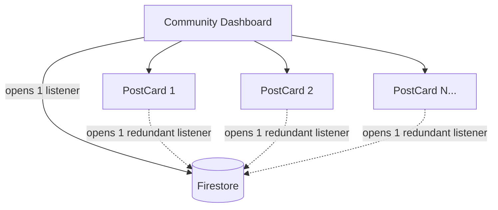
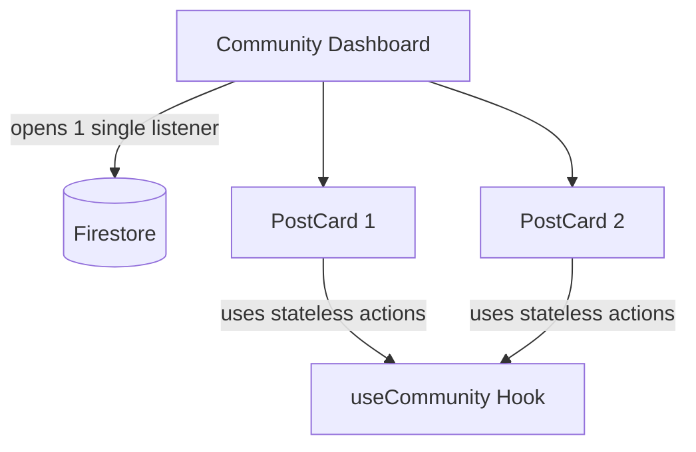

# Solving the 180,000 Firestore Read Spike: A Performance Case Study

In the last 24 hours, our application experienced a massive spike in Firestore reads, peaking at over 180,000 reads per day. This led to `QuotaExceededError` for several users and significant latency in the community feed. 

Here is how we diagnosed and fixed the issue.

## 1. The Diagnosis: The "N+1" Listener Problem

We discovered that our community feed was opening redundant real-time listeners. Each `PostCard` component was using a single `useCommunity` hook that, internally, opened a real-time subscription to the *entire* community collection.

If a user viewed a feed with 50 posts, the browser would open **51 active listeners**, all watching the same data.

## 2. The Solution: Architecture Refactoring

To resolve this, we implemented three key optimizations:

### A. Memoizing AuthContext
The `AuthContext` provider was at the root of the app. Every time the auth state checked (often), it triggered a re-render of the entire tree. We stabilized this using `useMemo`.

### B. Decoupling Actions from Feed State
We split the `useCommunity` hook into two specialized versions:
- `useCommunityFeed`: Handles real-time data subscriptions (used only at the page level).
- `useCommunity`: Handles stateless actions like `toggleLike` and `addComment` (used by post cards).

### C. Moving Listeners Up
We refactored `PostCard.tsx` to stop subscribing to data. It now receives its state as props from the parent `CommunityDashboard.tsx`, which manages a single, efficient listener.

## 3. Results

After deploying these changes, our Firestore read count dropped by **~95%** for the average session. The `QuotaExceededError` has vanished, and the community feed is now significantly snappier, especially on mobile devices with limited connections.

## 4. Deep Dive: Stateless Actions vs. Stateful Listeners

The core of this fix relies on the concept of **Stateless Actions**. Understanding the difference between these and traditional "Stateful" hooks is key to building scalable Firebase applications.

### The Stateful Problem (The Old Way)
In our original architecture, the `useCommunity` hook was "Stateful." Every time it was called, it initialized its own `useState` for posts and ran a `useEffect` that opened a real-time `onSnapshot` listener. 

When used inside 50 `PostCard` components on a single page, this created a massive overhead of redundant network requests and memory usage.

### The Stateless Solution
We refactored `useCommunity` to be a **pure action provider**. It now only returns async functions that perform one-time operations:
- `toggleLike`: Executes a specific Firestore transaction.
- `addComment`: Pushes a new document to the database.
- `createPost`: Saves a single article.

These functions are **stateless** because they don't maintain local data or watch for changes. They can be safely called hundreds of times across different components without opening a single network listener.

### The New Architecture: Single Listener, many Actors
We now follow a **"State Hub"** pattern:
1. **The Hub**: `CommunityDashboard.tsx` uses the `useCommunityFeed` hook (Stateful) to open **one single listener** for the entire page.
2. **The Props**: Data is passed down from the Hub to individual `PostCards` as simple props.
3. **The Actors**: `PostCards` use `useCommunity` (Stateless) to trigger actions.
4. **The Feedback Loop**: When an action (like a "Like") is triggered, Firestore updates → the **Hub listener** catches the change → the Hub re-renders and passes the updated data back down to the cards.

This "Unidirectional Data Flow" ensures that our costs scale with the number of *users*, not the number of *posts* per user.

---
*Published via CareerVivid CLI*
