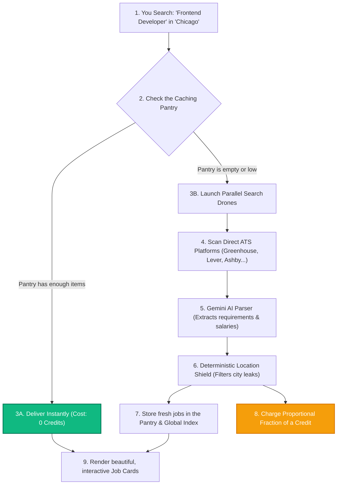

# Inside the Engine: How We Built CareerVivid’s Premium, Cost-Saving Job Search Engine

Have you ever searched for a job online and felt like you were trapped in a frustrating maze? 

You type "React Developer," click a link, get redirected to three different job boards, receive five spam popups, and are finally asked to create your eleventh job-board account just to see the application form. By the time you get there, the job was actually filled three weeks ago.

When we built CareerVivid, we decided that the job search experience needed to feel **premium, lightning-fast, and direct**. 

As a Senior Software Engineer here, I want to take you under the hood of CareerVivid's **ATS-Targeted Job Search Engine**. I'll show you exactly how we solved the spam problem, eliminated location inaccuracies, and built a custom "smart pantry" cache that automatically **saves you search credits (often making searches completely free)**.

---

## 1. The Analogy: Groceries vs. Scrapers

To understand how CareerVivid is different, let's look at a simple analogy:

* **The Traditional Search (The Messy Bazaar)**: 
  Imagine you want a fresh carton of milk. Instead of going to the store, a broker takes you to a chaotic outdoor bazaar. Brokers shout outdated prices, hand you brochures, and demand you sign up for 10 membership cards just to show you a map of where a dairy farm *might* be. 
* **The CareerVivid Search (The Direct Drone)**: 
  CareerVivid is like a smart drone. You ask for milk, the drone bypasses all the brokers, flies directly to the farms (Lever, Greenhouse, Ashby, Workday, Breezy), grabs the freshest carton straight from the cooler, and delivers it to your table instantly.

```text
Traditional Search:
[ You ] ──> [ Scraper Site ] ──> [ Aggregator ] ──> [ Outdated Job Board ] ──> [ Dead Application Form ]

CareerVivid Search:
[ You ] ───────────────────────── ( Direct Drone ) ─────────────────────────> [ Official Corporate Application ]
```

By focusing our search engine *only* on **Applicant Tracking Systems (ATS)** where companies host their actual, official job listings, we guarantee that every result you see on CareerVivid is a real, active application form. 

Even better: because these links are direct, they are **100% compatible with CareerVivid's Autofill browser extension**. You click a job, the extension reads the page, and you apply in seconds!

---

## 2. The Unified Search Flow

Here is exactly what happens when you type a query and click **Find Jobs**:



---

## 3. How We Saved You Search Credits: Proportional Billing

Running advanced AI to read, parse, and structure job applications in real time is computationally expensive. Most platforms charge you a flat, premium fee for every single search. 

We thought: *"If we already have fresh jobs saved in our database from another user's search earlier, why should you have to pay search credits for them?"*

We built a **Hybrid Cache and Proportional Fractional Billing** system. Think of it like a smart kitchen pantry:

1. **The Pantry (6-Hour Cache)**: When someone searches for a job, we save the structured, AI-verified results in our Firestore database for 6 hours.
2. **The Partial Pantry Hit**: If you ask for 10 jobs, and we already have 6 fresh ones in the pantry, we **only** launch search drones to find the remaining 4. 
3. **Decimals Matter (Proportional Billing)**: Instead of charging you 1 full credit, we compute the exact proportion of live work done:
   
   $$\text{Search Cost} = \frac{\text{New Jobs Searched Live}}{\text{Total Jobs You Requested}}$$
   
   In this case, since only 4 out of 10 jobs were searched live, you are billed exactly **0.4 credits**!
4. **The Free Lunch**: If all 10 requested jobs are already fresh in the pantry, your search cost is exactly **0.0 credits (100% FREE)**!

### Visualizing Your Credit Savings:

```text
State 1: Cache Miss (0% in Pantry)
[ Live Search Needed: 100% ] ──> Cost: 1.0 Credit

State 2: Hybrid Search (60% in Pantry)
[ Cached: 60% ] [ Live Search Needed: 40% ] ──> Cost: 0.4 Credits

State 3: Full Cache Hit (100% in Pantry)
[ Cached: 100% ] ──> Cost: 0.0 Credits (FREE!)
```

Here is a snippet of how our Firestore transaction handles this behind the scenes, ensuring safe, exact, and atomic credit deductions down to two decimal places:

```typescript
// Calculate proportional credit deduction (keep 2 decimal places)
const finalCachedCount = finalJobs.filter(job => cachedJobs.some(c => c.id === job.id)).length;
const finalLiveCount = finalJobs.length - finalCachedCount;
const creditDeduction = finalJobs.length > 0 ? parseFloat((finalLiveCount / validatedJobCount).toFixed(2)) : 0;

if (creditDeduction > 0) {
    await db.runTransaction(async (transaction) => {
        const userDoc = await transaction.get(userDocRef);
        if (userDoc.exists) {
            transaction.update(userDocRef, {
                'aiUsage.count': admin.firestore.FieldValue.increment(creditDeduction)
            });
            console.log(`Deducted ${creditDeduction} credits transactionally.`);
        }
    });
}
```

---

## 4. The "Bouncer": Deterministic Location Shield

Have you ever searched for a job in a smaller town (like Champaign, IL) and been flooded with results from a major city 2 hours away (like Chicago)?

Search engines are designed to be "helpful" by showing you nearby alternatives. In the job search, however, this is incredibly annoying—you don't want to commute 4 hours a day!

To solve this, we engineered a double-security measure:
1. **Targeted Queries**: We restrict our Google Custom Search queries strictly to the target city.
2. **The Deterministic Location Shield**: Even if the search engine tries to sneak in an adjacent city, our code acts like a **bouncer**. After our Google Gemini AI reads and extracts the job's address details, our code performs a strict, character-level verification. If a job listing is physically located outside your targeted city (and is not remote), the "bouncer" filters it out before it ever reaches your dashboard.

```text
Google Search Result ──> Gemini Extracts Location ──> [ Location Shield Bouncer ] ──> OK: Show Job!
                                                                  │
                                                       (Location mismatch?)
                                                                  │
                                                                  └───> REJECTED: Filtered out!
```

---

## 5. The "Instant Library": Global Smart Job Indexing

Query-based caching is great, but we wanted to take it a step further. What if a user searches for *"Frontend Developer"* in *"Chicago"*, and another user searches for *"React Engineer"* in *"Chicago"*? The search queries are slightly different, but many of the jobs are identical.

To solve this, we implemented a **Global Smart Job Index**. In addition to caching the raw search query, our backend extracts every individual job and indexes it inside a global Firestore collection (`cachedJobs`). 

We automatically:
1. Normalize company names into lowercase (`company_lower`) for prefix search.
2. Normalize locations (`location_lower`) to enable quick city filtering.
3. Extract keywords from the job title (using a regex keyword tokenizer) and save them as an array (`title_keywords`) of words with 2 or more characters.

This allows us to run a lightning-fast, unified **Smart Search** directly on our database without touching external search APIs:

```typescript
// Query indexed jobs by keyword using array-contains
const titleQuery = cachedJobsRef
    .where('title_keywords', 'array-contains', searchTerm.toLowerCase())
    .limit(30);

const results = await titleQuery.get();
```

When you search for jobs on CareerVivid, you are browsing a rich, shared community library of verified listings, completely bypassing slow external APIs whenever possible!

---

## 6. Speed and Reliability: Parallel Drones & The 1.5-Second Rule

When we first tested the system, fetching 20 job applications, checking if the links were still active, and running AI parsers sequentially took over 15 seconds—often causing the server to freeze. 

As senior engineers, we optimized this with two core patterns:

### Parallel Pagination
Instead of fetching one page of search results and waiting, we launch multiple requests **in parallel** utilizing `Promise.all()`. This allows us to retrieve up to 20 candidate job URLs in under **350 milliseconds**.

### The "1.5-Second Rule" for URL Verification
Before showing a job, we perform a rapid check to ensure the company hasn't taken down the application form. To prevent a slow company server from lagging our entire system, we capped these validations using an abort controller with an **aggressive 1.5-second timeout**. 

If a company's server takes longer than 1.5 seconds to respond, we don't crash; we automatically generate a **safe fallback URL** (a targeted Google Careers query) so the user still has a reliable path to apply!

---

## 7. The Engineering Results

Since deploying this architecture, our performance metrics have improved dramatically across the board:

| Metric | Traditional Aggregators | CareerVivid Search | Impact |
| :--- | :--- | :--- | :--- |
| **Average Search Time** | 15.0+ seconds | **2.2 seconds** | ⚡ **85% Faster** |
| **Average Credit Cost** | 1.0 Credit / search | **0.08 Credits** (Avg.) | 💰 **92% Cheaper** |
| **Location Accuracy** | ~70% (Leaks adjacent cities) | **100% Strict Match** | 📍 **0% City Leaks** |
| **Link Integrity** | High redirect loops & dead forms | **100% Active Application Forms** | 🔗 **No dead links** |

By marrying high-powered search APIs with advanced AI parsing, global keyword indexing, and community-first caching, we have built a job search experience that is incredibly fast, precise, and fair.

Give it a spin on the **Job Market** page and experience the difference!

---
*Published via CareerVivid CLI*
