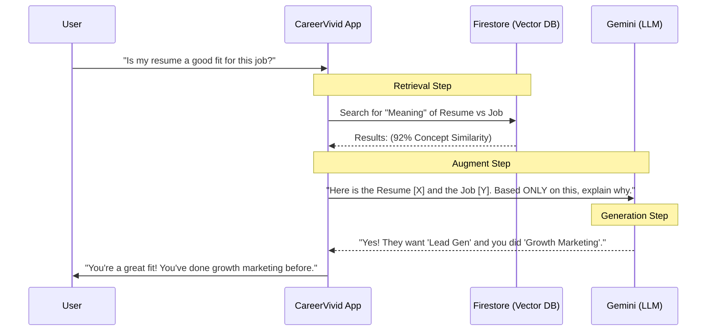

# Understanding Vector Search & RAG (The "Librarian" Way)

If technical explanations feel a bit dense, let's use a real-world analogy: **The Librarian.**

---

## 1. Vector Search: The Librarian's Memory 🧠
Imagine you go to a library and ask for *"a book about a detective who solves crimes in London."*

- **Keyword Search**: The librarian looks for books with the exact word "detective." If a book is titled "A Mystery in Baker Street," the librarian might miss it.
- **Vector Search**: The librarian understands the **vibe**. They know "Baker Street" + "Mystery" + "London" = **Sherlock Holmes**. They don't need the word "detective" to find what you want.

**In CareerVivid**: If a student says they are good at "building websites," Vector Search finds jobs looking for "Fullstack Developers" because it knows they are the same concept.

---

## 2. RAG: The Librarian's Research 📚
Imagine you ask: *"Does this library have a copy of the new Silicon Valley biography published yesterday?"*

The librarian is smart (they have a brain), but they haven't memorized the book yet.

- **Step 1 (Retrieval)**: The librarian goes to the shelf, finds the new book, and reads the table of contents.
- **Step 2 (Augment)**: They keep that book open in their hands.
- **Step 3 (Generation)**: They answer your questions **while looking at the book**.

---

## 3. How it looks in your App 🚀

Let's look at a "Smart Match" example. This is what happens under the hood:

---

## 4. FAANG Example: Amazon's "Instant Support" 🛒

Imagine Amazon has 50,000 different instruction manuals for every product they sell.

- **The Problem**: A user says, *"My Kindle screen is frozen and won't turn off."*
- **Vector Search (The Specialist)**: Instead of searching for the word "frozen," Amazon's system finds the **concept** of "Screen Unresponsiveness" in their massive technical database.
- **RAG (The Assistant)**: The system "grabs" the specific paragraph for the **Kindle Paperwhite (11th Gen)** and feeds it to the AI.
- **The Result**: The AI says: *"I'm sorry your 11th Gen Kindle is stuck. Please hold the power button for exactly 40 seconds."*

---

## 5. Enterprise Best Practices (The "Pro" Way) 🏢

When building this for a real company (or CareerVivid), you don't just "dump" text into a database. You use these three techniques:

### 1. Chunking (Don't eat the whole pizza) 🍕
You cannot feed an AI a 200-page PDF at once. 
- **Best Practice**: Break data into "chunks" of ~500 words. Each chunk gets its own Vector coordinate. This makes the search much more precise.

### 2. Metadata Filtering (The "Security Guard") 🛡️
If a user is in **Canada**, they shouldn't see job listings for **Japan**.
- **Best Practice**: Use "Hard Filters" (SQL-style) for things like `Location`, `Version`, or `Language` **before** doing the Vector Search. This saves money and improves accuracy.

### 3. Hybrid Search (The "Double Check") ✅
Sometimes Keywords are just better (e.g., searching for a specific Product ID like `B09G96T6BD`).
- **Best Practice**: Combine **Keyword Search** (BM25) with **Vector Search**. This is what Google and Amazon do to ensure they never miss an exact match while still "understanding" the vibe.

> [!TIP]
> For **CareerVivid**, the "Hybrid" approach is best: Use Keywords for "Company Name" but use Vector Search for "Skill Matching."
