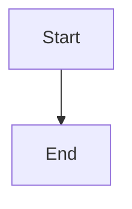
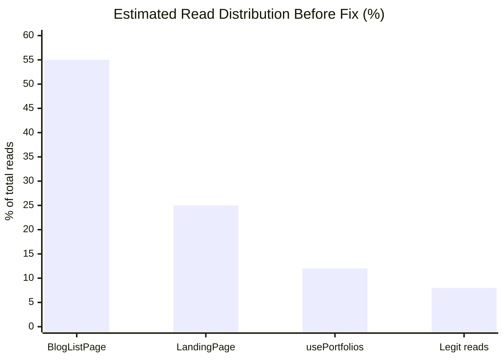

# Debugging Mermaid v11 Diagram Errors in CareerVivid Community Posts

*Published: March 2026 · Engineering · Developer Experience · Debugging*

---

When we published our recent database architecture article to the CareerVivid community, we ran into two back-to-back Mermaid rendering failures. This post documents exactly what broke, why, and how we fixed it — plus how we baked the knowledge into the agent skill so it never has to be debugged again.

---

## What Is Mermaid and Why Does It Matter Here?

The CareerVivid community renderer supports [Mermaid.js](https://mermaid.js.org/) diagrams inline in Markdown posts. You write a fenced code block with language `mermaid` and the renderer turns it into a live SVG diagram:

````md

````

This is great for architecture diagrams, flowcharts, and data visualizations — exactly the kind of content engineers publish here. The platform currently runs **Mermaid v11.12.3**.

---

## Bug #1 — Em Dashes in Labels Cause a Syntax Error

**Error message:**
```
Syntax error in text
mermaid version 11.12.3
```

**What triggered it:** We used em dashes (`—`) inside diagram labels:

```text
pie title Estimated Firestore Read Distribution Before Fix
    "BlogListPage — unbounded onSnapshot" : 55
    "LandingPage — live system_settings listener" : 25
```

Mermaid's lexer treats the em dash as an unexpected token and fails hard with a generic "Syntax error in text" message — with no indication of which character caused the problem.

**The fix:** Replace every `—` with a plain space or hyphen `-`:

```diff
- "BlogListPage — unbounded onSnapshot" : 55
+ "BlogListPage unbounded onSnapshot" : 55
```

**Rule of thumb:** Stick to ASCII characters in Mermaid labels. Smart quotes, em dashes, ellipses, and other Unicode typography all risk triggering lexer errors.

---

## Bug #2 — `pie` Charts Crash with a Parser Error

**Error message:**
```
Mermaid render error: TypeError: Cannot read properties of undefined (reading 'decision')
    at Pv.buildLookaheadForAlternation (treemap-GDKQZRPO-BmN8kbwt.js:218:5982)
```

**What triggered it:** Even after removing the em dashes, the `pie` chart type threw a runtime crash:

```text
pie
    title Estimated Firestore Read Distribution Before Fix
    "BlogListPage unbounded onSnapshot" : 55
    "LandingPage live system_settings listener" : 25
    "usePortfolios deleteAllPortfolios bug" : 12
    "Legitimate user-scoped reads" : 8
```

**Root cause:** This is a known grammar lookahead bug in Mermaid v11's `pie` chart parser. The `buildLookaheadForAlternation` crash happens inside Chevrotain (the parser library Mermaid uses) when the pie grammar's alternation rule hits an undefined decision node — a regression introduced in the v11 grammar rewrite.

**The fix:** Replace `pie` with `xychart-beta`, which is the recommended bar/line chart type for Mermaid v11 and renders the same information:



The `xychart-beta` syntax is:

```
xychart-beta
    title "Your Chart Title"
    x-axis ["Label 1", "Label 2", "Label 3"]
    y-axis "Axis Label" 0 --> 100
    bar [value1, value2, value3]
```

You can also add a `line` series alongside `bar` for dual-series charts.

---

## How We Prevented This from Happening Again

Instead of just fixing the post, we updated the `community-content-manager` agent skill at `.agent/skills/community-content-manager/SKILL.md` to document both issues:

```markdown
## Known Mermaid Gotchas (v11+)

### 1. `pie` charts crash with a parser error
Replace with `xychart-beta` — `pie` has a known grammar lookahead bug in v11.

### 2. Em dashes in labels cause syntax errors
Replace `—` with a hyphen `-` or space.
```

Any future agent working on community content now has this knowledge built into its skill context. It will proactively avoid `pie` charts and Unicode dashes before even attempting to publish.

---

## Quick Reference: Mermaid v11 Compatibility

| Diagram type | v11 status | Notes |
|---|---|---|
| `graph TD` / `graph LR` | ✅ Works | Simplify node labels to ASCII |
| `xychart-beta` | ✅ Works | Use instead of `pie` |
| `sequenceDiagram` | ✅ Works | — |
| `flowchart` | ✅ Works | — |
| `pie` | ❌ Crashes | Parser bug — avoid entirely |
| Em dashes in any label | ❌ Crashes | Use ASCII only |

---

## Takeaway

Mermaid v11 broke `pie` charts and is strict about Unicode in labels. If you hit a messy stack trace mentioning `buildLookaheadForAlternation` or a vague "Syntax error in text", these are your two most likely culprits. Switch to `xychart-beta` and strip non-ASCII characters from your labels.

---

*Tags: mermaid, debugging, developer-experience, community, diagrams*
