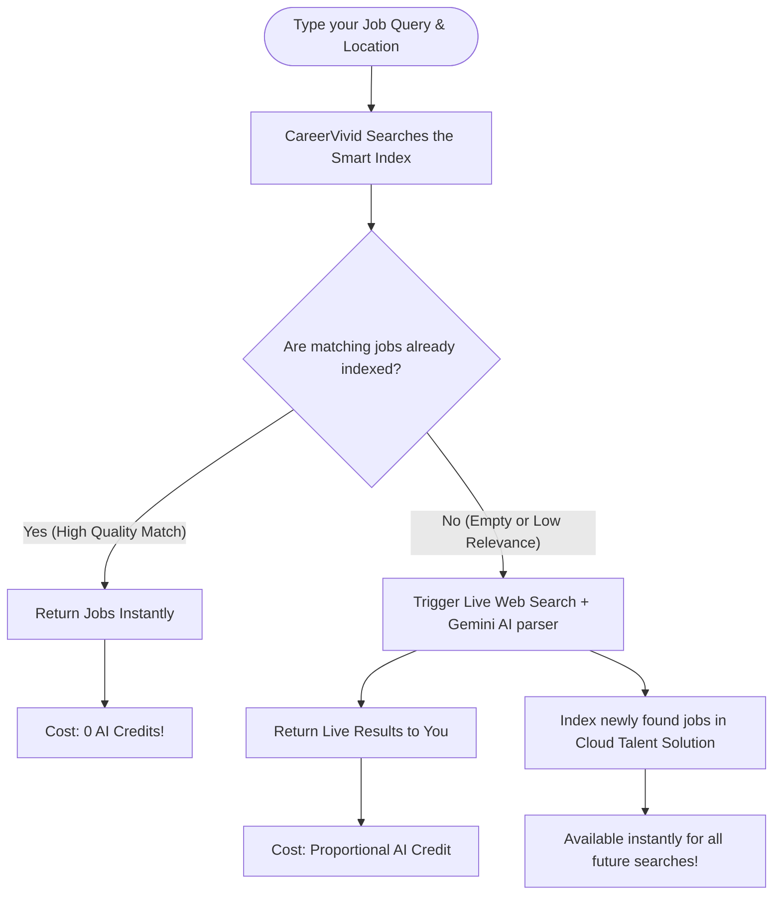

# CareerVivid Intelligent Job Search Engine
## Powered by Google Cloud Talent Solution (v4)

Welcome to the new era of job searching on CareerVivid! We have completely overhauled our search engine to make it incredibly fast, highly accurate, and semantically intelligent. 

This guide explains how this new system works in plain English—no technical degree required!

---

## 🌟 Why this matters to you (The Key Benefits)

Previously, searching for a job on the web meant waiting for a slow robot (a "scraper") to scour the internet on-demand, which could take a while and sometimes returned mismatched results. 

Our new **Google Cloud Talent Solution (v4)** search engine changes all of that:

* **Instantaneous Search (Zero-Lag):** Searches happen in milliseconds because jobs are stored and pre-indexed in our smart cloud database.
* **Semantic Intelligence (It understands what you *mean*):** If you search for "Software Engineer," the system understands that "Web Developer," "Full Stack Engineer," and "Frontend Developer" are highly related and will display those too. It searches for *intent*, not just exact spelling.
* **Smart Autocomplete:** As you type, the search bar instantly suggests popular, real-world job titles to help you refine your search.
* **Location-Aware (Radius) Searching:** The search engine automatically understands geographical coordinates. You can search for roles within a 50-mile radius of your city without needing exact zip codes.
* **Always Fresh (14-Day Expiration):** Old, expired listings are automatically deleted after 14 days, so you never waste time applying to dead postings.
* **Saves Your Credits:** Searching cached, pre-indexed jobs is **100% free** and consumes **0 AI credits**. You only use AI credits when the system performs a brand-new live web scrape to find fresh listings.

---

## 🧠 How it Works: The "Organic Scrape-and-Cache" Cycle

Instead of running massive, expensive web crawlers 24/7, CareerVivid uses a smart **organic caching system**. Here is what happens when you type a query:

### 1. The Instant Lookup (Cache Hit)
When you search, CareerVivid immediately asks the **Google Cloud Talent Solution** if we already have jobs for your query. If we do, they are displayed on your screen instantly. This process is lightning-fast and costs you **zero AI credits**!

### 2. The Smart Fallback (Cache Miss)
If you search for a highly specific or niche role that isn't in our index yet, the system gracefully shifts gears. In the background, it runs a live search on Google and uses **Gemini AI** to clean up the postings, remove spam, format the descriptions, and show them to you. 

### 3. Automatic Warm-Up (Indexing)
The moment those brand-new jobs are returned to you, the system automatically indexes them in our smart search engine. The next time you (or any other user) search for that same type of job, it will load **instantly** with **zero wait time**!

---

## 🛡️ Anti-Pollution & Relevancy Protections

We want to make sure your search results are clean and highly relevant. To ensure this, we have built-in "shields" that protect the quality of your listings:

> [!NOTE]
> **The Generic Blacklist Shield**
> The system automatically discards generic, unhelpful, or spammy postings (like *"Various Openings," "Talent Pool," "Future Career Opportunities,"* or *"General Application"*). You only see real, actionable job opportunities.

> [!IMPORTANT]
> **Synonym Expansion**
> If you search for an IT job, the system expands the query behind the scenes to look for related fields like *computer, networking, system administrator, support,* and *cybersecurity*, guaranteeing that you don't miss out on adjacent roles.

---

## 🔄 Daily Housekeeping (Automatic Cleanups)

To keep the system running smoothly and ensure you aren't seeing stale postings, our system has a built-in lifecycle routine:

* **Strict 14-Day TTL (Time-To-Live):** Every single job listing has an expiration date. 
* **Midnight Cleanup Cron:** Every night at midnight, a automated task runs to delete any job listing older than 14 days from our index and our database. 

This ensures that the database remains lightweight, lightning-fast, and packed only with active, relevant listings.

---

## 💬 Frequently Asked Questions (FAQ)

### Is my search data secure?
Absolutely. We do not share your private searches or profile data with any third-party job boards. The system queries Google Cloud Talent Solution securely using our server credentials.

### Why did a search deduct 0 credits?
If you see a notification saying `0 credit deducted`, it means our smart index already had plenty of high-quality, relevant results for your search. We believe you shouldn't pay for cached data!

### Why did a search deduct 1 credit?
If your search term was brand-new or required fresh listings, our system performed a live web scrape and parsed the postings using Gemini AI. This process consumes server computing power, which is why it utilizes 1 AI credit from your monthly quota.
