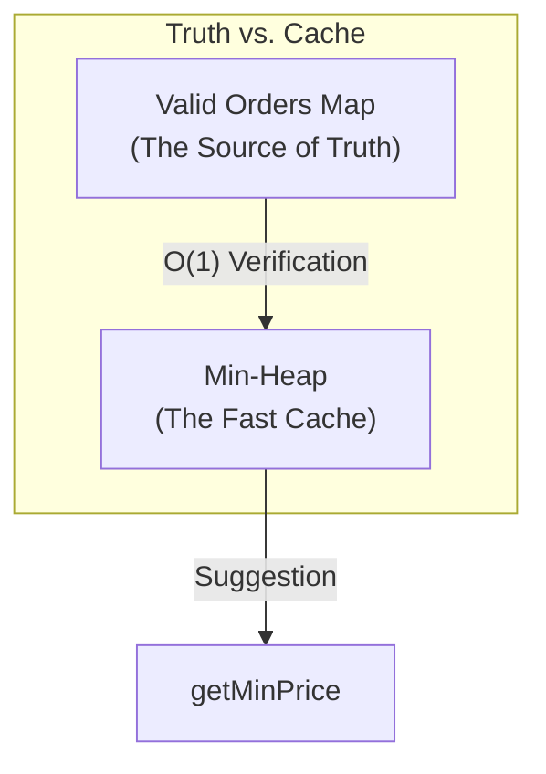
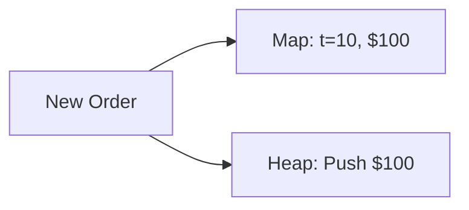
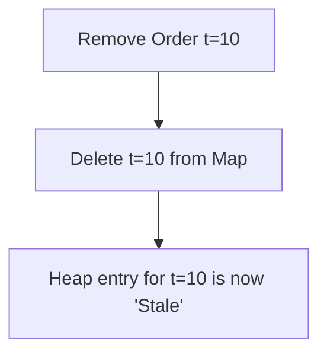
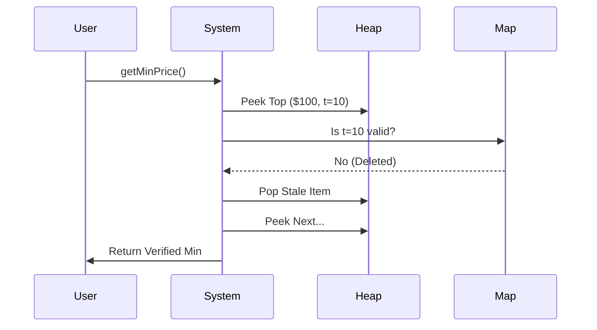

# Visual Architecture & Interaction

This document visualizes the high-level architecture of the Product Inventory System, specifically focusing on the interaction between the **Min-Heap** and the **Valid Orders Map**.

## The "Truth vs. Cache" Pattern

To handle millions of orders with sub-millisecond latency, we use a hybrid approach called **Lazy Deletion**.

### 1. Submitting an Order
When an order is submitted:
1.  **Map**: Updated with the new price ($O(1)$).
2.  **Heap**: A new entry is pushed ($O(\log N)$).

### 2. Lazy Deletion
When an order is removed, we **only** remove it from the Map. The Heap entry remains until it is naturally "cleaned" during a read operation.

### 3. The "Reality Check" (getMinPrice)
The system only cleans the heap when you actually ask for the minimum price.

---

## Navigation
- [Return to Series Overview](https://careervivid.app/community/post/X4A3G6x1Z2bv2KjlOtSh)
- [Next: Deep Dive into Maps & Heaps](https://careervivid.app/community/post/MKlIdH165lIHG7cY3UiK)
